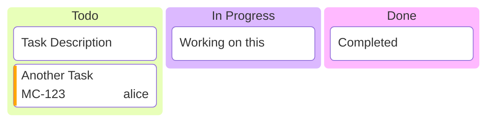

# Kanban Boards

Visual workflow representation with columns and tasks.

## Syntax



## Columns

```
columnId[Column Title]
```

Columns represent workflow stages (Todo, In Progress, Review, Done, etc.).

## Tasks

```
taskId[Task Description]
```

Tasks are indented under their column.

## Task metadata

```
task1[Description]@{ ticket: MC-2037, assigned: 'knsv', priority: 'High' }
```

| Key | Values |
| --- | --- |
| `ticket` | Any string (issue/ticket ID) |
| `assigned` | Person name |
| `priority` | `Very High`, `High`, `Low`, `Very Low` |

## Configuration

Under the `kanban` config key:

| Option          | Type   | Default | Description                                      |
|-----------------|--------|---------|--------------------------------------------------|
| `ticketBaseUrl` | string | —       | Base URL for ticket links; `#TICKET#` is replaced |

```yaml
---
config:
  kanban:
    ticketBaseUrl: 'https://yourproject.atlassian.net/browse/#TICKET#'
---
```

When a task has a `ticket` metadata key, the ticket ID becomes a clickable link using the base URL.
