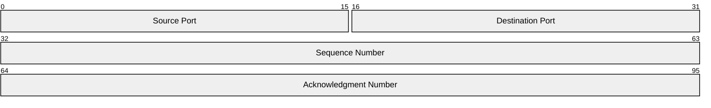
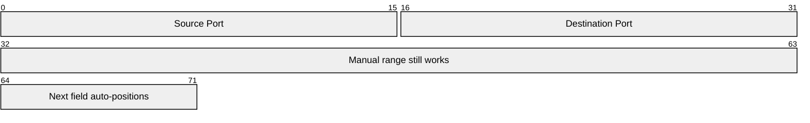
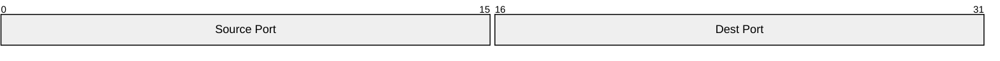
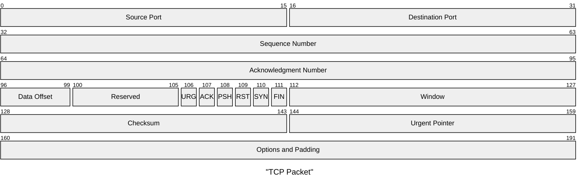
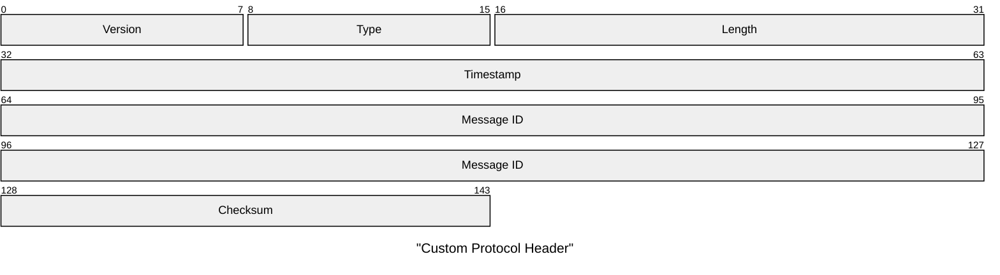
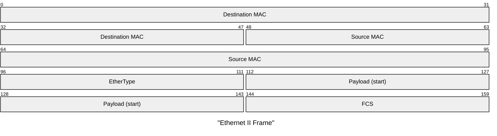

# Packet Diagram Reference

## Description

Packet diagrams illustrate the structure and contents of network packets. Fields are defined by bit ranges or bit counts, with labels for each field. Useful for network engineering and protocol documentation.

> **Note:** Uses `packet` keyword. Bit count syntax (`+N`) available since v11.7.0+.

## Basic Syntax



## Bit Range Syntax

```
start-end: "Field Name"
```

- `start` — Starting bit position
- `end` — Ending bit position
- Single-bit fields: `100: "Flag"` (same start and end)

## Bit Count Syntax (v11.7.0+)

```
+N: "Field Name"
```

- `+N` — Number of bits from the end of the previous field
- Fields are placed sequentially, auto-calculating positions

### Mixed Syntax

Both styles can be combined:



## Comments

Use `%%` for inline comments:



## Examples

### TCP Packet



### Custom Protocol



### Ethernet Frame


