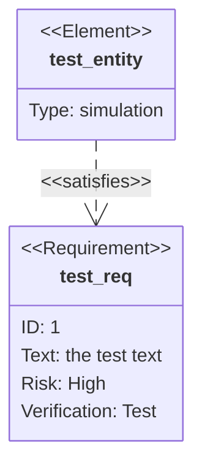
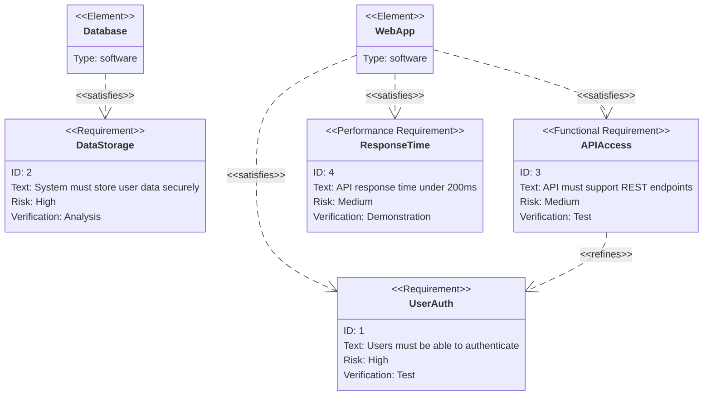

# Requirement Diagram Reference

## Description

Requirement diagrams visualize requirements and their connections, following SysML v1.6 specifications. Three component types: requirement, element, and relationship.

## Basic Syntax



## Requirements

### Syntax

```
<type> name {
    id: <value>
    text: <description>
    risk: <low|medium|high>
    verifymethod: <analysis|inspection|test|demonstration>
}
```

### Type Options

| Type | Description |
|------|-------------|
| `requirement` | Functional or non-functional requirement |
| `functionalRequirement` | Specific functional requirement |
| `interfaceRequirement` | Interface specification |
| `performanceRequirement` | Performance criteria |
| `physicalRequirement` | Physical constraints |
| `designConstraint` | Design limitations |

### Properties

| Property | Values | Description |
|----------|--------|-------------|
| `id` | Any string/number | Unique identifier |
| `text` | Any text | Description of requirement |
| `status` | Any text | Current status |
| `risk` | `low`, `medium`, `high` | Risk level |
| `verifymethod` | `analysis`, `inspection`, `test`, `demonstration` | Verification method |

## Elements

```
element name {
    type: <type>
}
```

### Type Options

| Type | Description |
|------|-------------|
| `software` | Software component |
| `hardware` | Hardware component |
| `person` | Person/stakeholder |
| `organization` | Organization |
| `facility` | Physical facility |
| `service` | External service |
| `simulation` | Simulation model |

## Relationships

```
element - <relationship> -> requirement
requirement - <relationship> -> requirement
```

### Relationship Types

| Relationship | Description |
|-------------|-------------|
| `satisfies` | Element satisfies a requirement |
| `refines` | Requirement refines another |
| `copy` | Copy of a requirement |
| `derivedfrom` | Derived from another requirement |
| `triggeredby` | Triggered by an element |

## Examples

### System Requirements



### Simple Traceability

```mermaid
requirementDiagram
    requirement Safety {
        id: S1
        text: System must fail safely
        risk: high
        verifymethod: analysis
    }
    requirement Reliability {
        id: R1
        text: 99.9% uptime
        risk: medium
        verifymethod: test
    }
    designConstraint TechStack {
        id: DC1
        text: Must use open-source components
        risk: low
        verifymethod: inspection
    }

    element Backend {
        type: software
    }

    Backend - satisfies -> Safety
    Backend - satisfies -> Reliability
    Safety - derivedfrom -> TechStack
```
