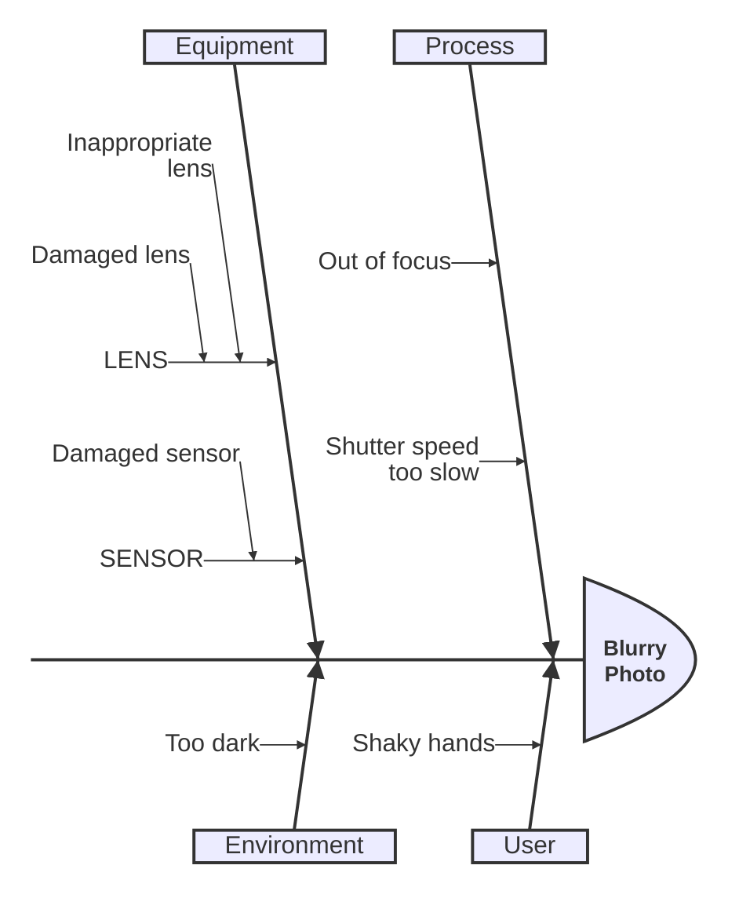
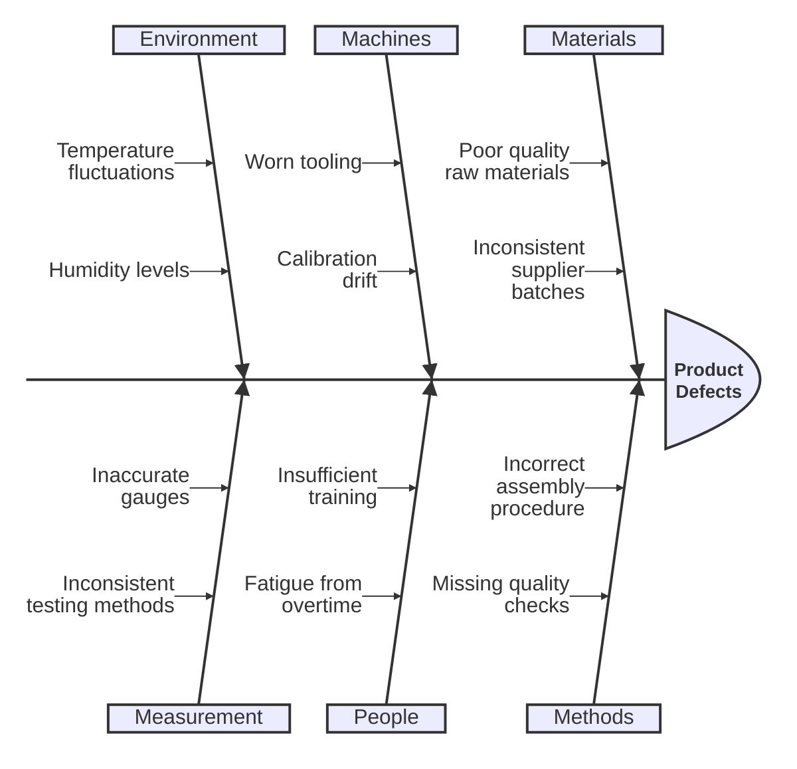
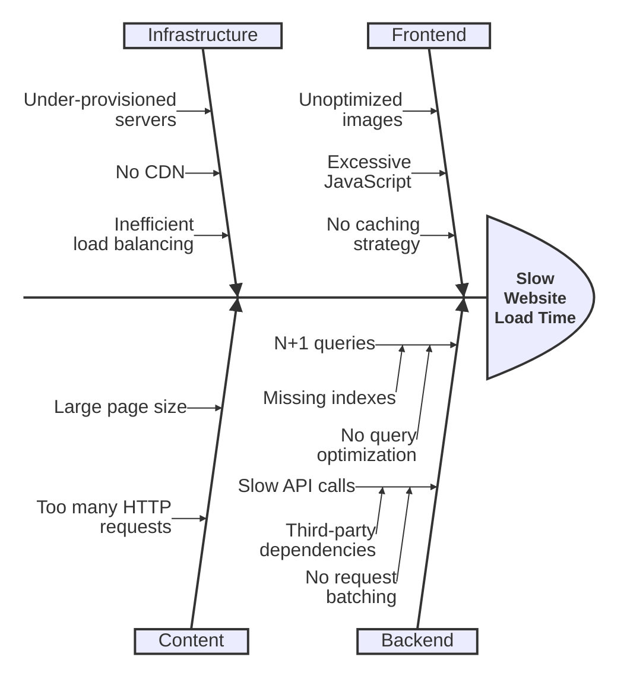
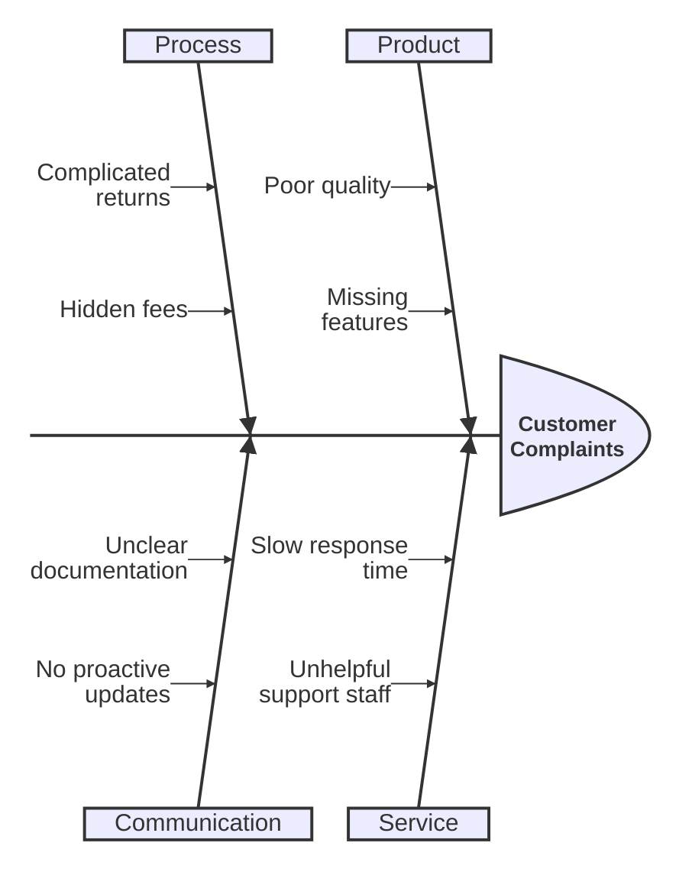

# Ishikawa Diagram Reference

## Description

Ishikawa (fishbone) diagrams represent causes of a specific event or problem. The main problem sits at the "head" with cause categories branching off like fishbones. Also called cause-and-effect or herringbone diagrams.

> **Note:** Uses `ishikawa-beta` keyword — experimental, syntax may evolve. (v11.12.3+)

## Basic Syntax

## Structure

- **First line:** The event/problem (the "fish head")
- **Subsequent top-level lines:** Cause categories (main fishbones)
- **Indented lines:** Sub-causes branching from categories
- **Deeper indentation:** Further sub-causes

## Examples

### Manufacturing Defect

### Website Performance

### Simple Root Cause Analysis

