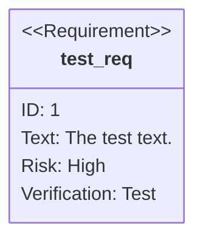
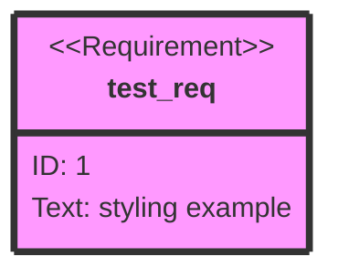
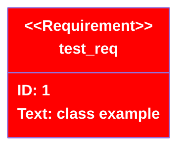

# Requirement Diagrams

SysML-style requirements visualization with traces, conflicts, and hierarchy.

## Requirements



### Types

| Keyword | Description |
| --- | --- |
| `requirement` | General requirement |
| `functionalRequirement` | Functional requirement |
| `interfaceRequirement` | Interface requirement |
| `performanceRequirement` | Performance requirement |
| `physicalRequirement` | Physical requirement |
| `designConstraint` | Design constraint |

### Risk levels

`Low`, `Medium`, `High`

### Verification methods

`Analysis`, `Inspection`, `Test`, `Demonstration`

## Elements

```
element test_entity {
    type: simulation
}
```

Elements connect requirements to external documents/artifacts.

## Relationships

```
test_entity - satisfies -> test_req
test_req - traces -> other_req
test_req - conflicts -> other_req
req1 - contains -> req2          %% Hierarchy
```

| Relationship | Arrow | Meaning |
| --- | --- | --- |
| `satisfies` | `- satisfies ->` | Element fulfills requirement |
| `traces` | `- traces ->` | Requirement derives from another |
| `conflicts` | `- conflicts ->` | Requirements conflict |
| `contains` | `- contains ->` | Parent-child hierarchy |

## Direction

```
direction TB   %% Top-to-bottom (default)
direction BT   %% Bottom-to-top
direction LR   %% Left-to-right
direction RL   %% Right-to-left
```

## Styling

### Direct styling



### Class definitions



Multiple requirements and classes can be assigned at once. The shorthand `:::` assigns multiple classes to a single requirement.
