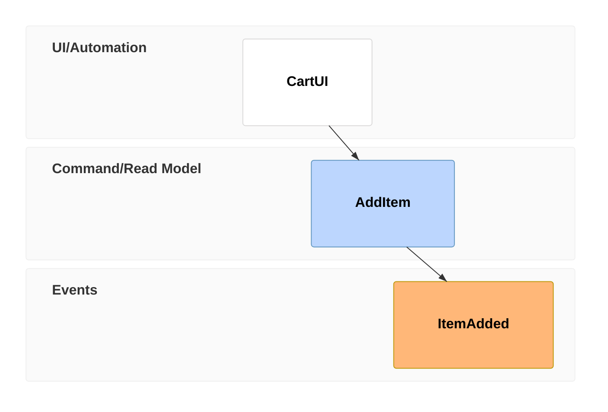

# Event Modeling Diagrams (v11.15.0+)

Describe systems through information flow over time. Entities organized in swimlanes forming a timeline.

## Basic syntax

```
eventmodeling
    timeframe 01 ui CartUI
    timeframe 02 command AddItem
    timeframe 03 event ItemAdded
    timeframe 04 aggregate ShoppingCart
    timeframe 05 policy ValidateStock
```

### Entity types (shorthand)

| Shorthand | Full form | Description |
| --- | --- | --- |
| `ui` | — | User interface trigger |
| `cmd` | `command` | Command |
| `evt` | `event` | Domain event |
| `agg` | `aggregate` | Aggregate root |
| `policy` | — | Policy/automation |
| `view` | — | Read model/view |
| `processor` | — | Processor trigger |

### Time frames

Each time frame has a unique number and entity identifier. Numbers don't need to be sequential, just unique.

### Inline data

Add data examples on the same line in curly braces:

```
eventmodeling
    timeframe 02 command AddItem { description: string }
    timeframe 03 event ItemAdded { description: string }
```

### Data blocks

Reference structured data with `[[identifier]]`. Define blocks separately with `data` keyword.

```
eventmodeling
    timeframe 02 command AddItem [[AddItem01]]
    timeframe 03 event ItemAdded [[ItemAdded]]

    data AddItem01 {
      description: 'john'
      price: 20.4
    }

    data ItemAdded {
      description: string
      price: number
    }
```

Suffix identifiers with numbers when the same entity appears multiple times (e.g., `AddItem01`, `AddItem02`).

### Data block types

Prepend backtick-quoted type for syntax highlighting: `json`, `jsobj`, `md`, `html`, `text`, `uri`, `figma`, `salt`.

```
    timeframe 01 readmodel UserAdded `json`{ "name": "foo" }
```

### Reset frames

Break inferred flow with `rf` / `resetframe`. New frames start a fresh inference chain.

```
eventmodeling
    timeframe 01 ui CartUI
    timeframe 02 command AddItem
    timeframe 03 event ItemAdded

    resetframe 04 event External.InventoryChanged
    timeframe 05 processor InventoryProcessor
    timeframe 06 command ChangeInventory
```

### Multiple relations

Use `->>` to link a read model to multiple events:

```
eventmodeling
    resetframe 02 event CartCreated
    resetframe 03 event ItemAdded
    resetframe 04 event ItemRemoved
    timeframe 01 readmodel CartUI ->> 02 ->> 03 ->> 04
```

## Relaxed notation



Full keywords instead of shorthand.

## Entity types and swimlanes

| Shorthand | Full form | Default swimlane |
| --- | --- | --- |
| `ui` | — | UI/Automation |
| `pcr` | `processor` | UI/Automation |
| `cmd` | `command` | Command/Read Model |
| `rmo` | `readmodel` | Command/Read Model |
| `evt` | `event` | Events |

### Namespaces

Prefix entity identifiers with `Namespace.` to create custom swimlanes. Order of first appearance determines swimlane order.

```
eventmodeling
    resetframe 01 event Inventory.InventoryChanged
    resetframe 02 event External.InventoryChanged
```

## Patterns

### State Change

UI → Command → Event (user triggers a state change).

### State View

Event → Read Model → UI (current system state displayed to user).

### Translation

External Event → Processor → Command/View (translating external events into internal actions).

### Automation

Policy-driven reactions to events without user interaction.
