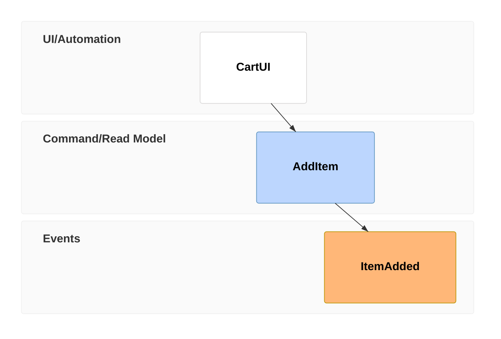
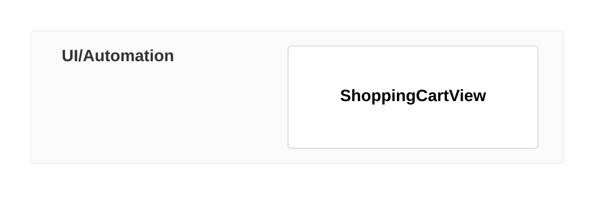
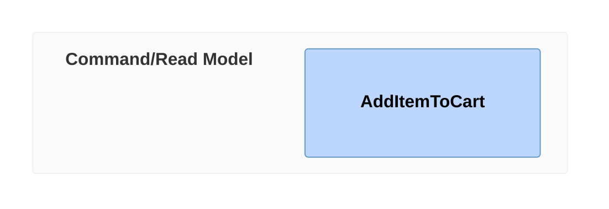
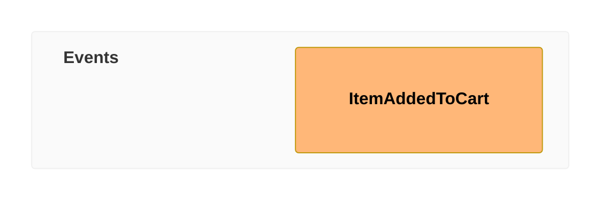
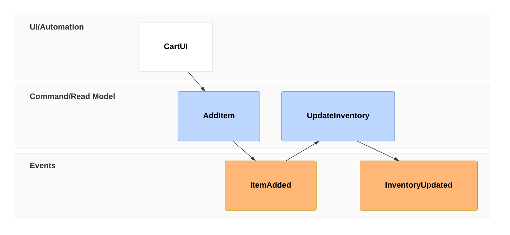

# Event Modeling Reference

## Description

Event Modeling diagrams describe systems by showing how information changes over time. Entities are organized in swimlanes forming a timeline. Relations among entities are inferred by default for rapid creation.

> **Note:** Uses `eventmodeling` keyword. (v11.15.0+)

## Basic Syntax

## Time Frames

Time frames are the key building blocks, typed by entity type:

| Token (compact) | Token (relaxed) | Entity Type |
|-----------------|-----------------|-------------|
| `tf` | `timeframe` | Time frame declaration |
| `ui` | `ui` | User Interface / View |
| `cmd` | `command` | Command |
| `evt` | `event` | Event |
| `proc` | `processor` | Processor |

### Compact Notation

### Relaxed Notation

## Entity Types

### UI (User Interface / Read Model)

### Command

### Event

### Processor

## Commands and Events with Properties

## Relationships

Relationships between entities are inferred by default based on timeline order. Explicit relationships can be declared:

## Examples

### Shopping Cart Flow

### With Properties

### Complex Workflow

