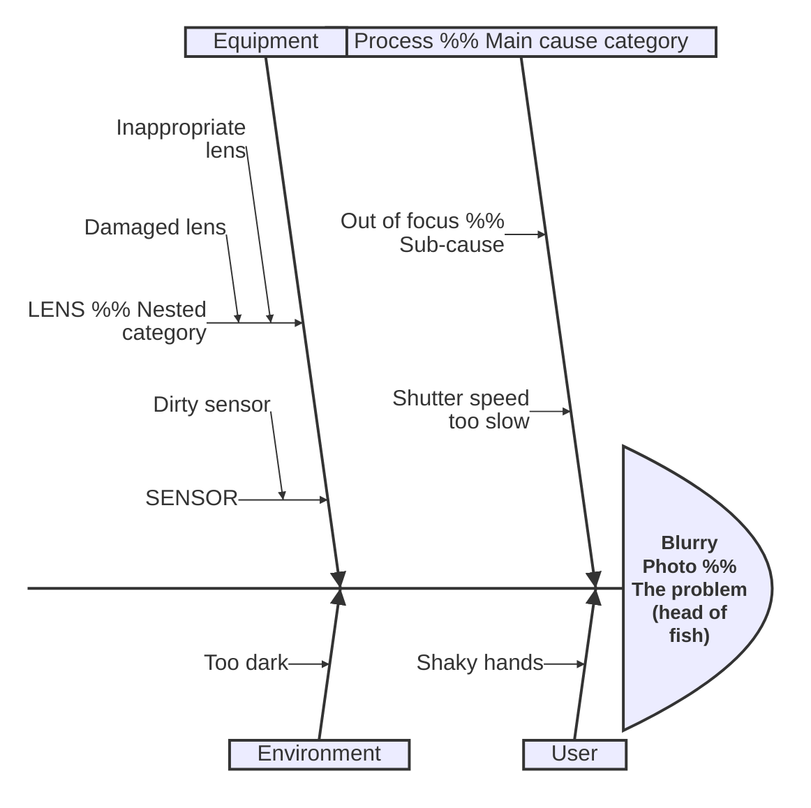

# Ishikawa Diagrams (v11.12.3+)

Fishbone (cause-and-effect) diagrams for root cause analysis.

## Syntax

## Structure

- First line: the event/problem (fish head)
- Top-level indented lines: main cause categories (fish bones)
- Further indentation: sub-causes (smaller bones)
- Supports arbitrary nesting depth
- Hierarchy defined entirely by indentation
