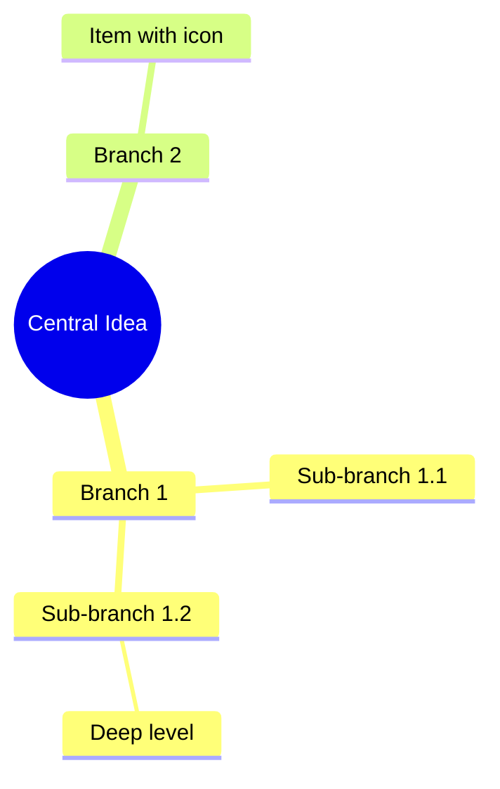

# Mindmaps

Hierarchical idea organization with indentation-based syntax.

## Syntax



## Node shapes

| Syntax | Shape |
| --- | --- |
| `root((text))` | Circle (default root) |
| `node(text)` | Rounded rectangle |
| `node[text]` | Rectangle |
| `node{text}` | Rhombus |
| `node[[text]]` | Subroutine |
| Plain text | Default shape |

## Icons

```
::icon(fa fa-book)
::icon(fa fa-star)
```

Place icon directive on its own line, indented to the target node level. Requires FontAwesome CSS or registered icon pack.

## Markdown in labels

Use `<br/>` for line breaks within node text.

## Classes

Apply `classDef` and `class` to style nodes:

```
mindmap
  root((Root))
    Branch A:::important
    Branch B

classDef important fill:#f9f,stroke:#333,stroke-width:4px;
```

## Layouts

Use `tidy-tree` for hierarchical/tree-style layout:

```yaml
---
config:
  layout: tidy-tree
---
mindmap
root((Central Idea))
    Branch 1
    Branch 2
```

Default layout is radial. Supported layouts: `elk` (default), `tidy-tree`.
