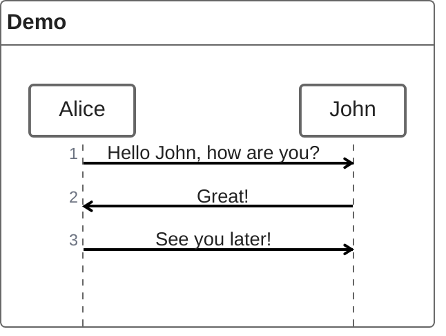
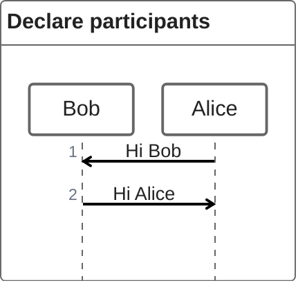
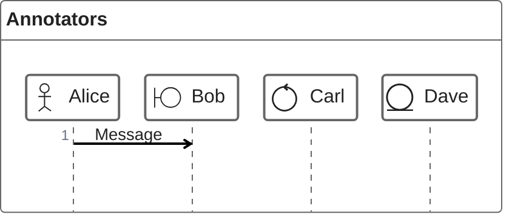
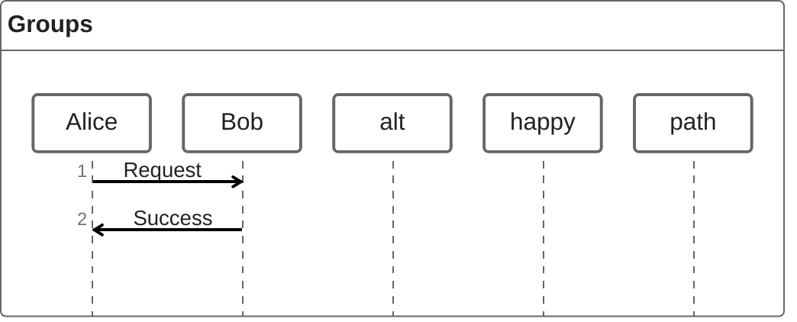
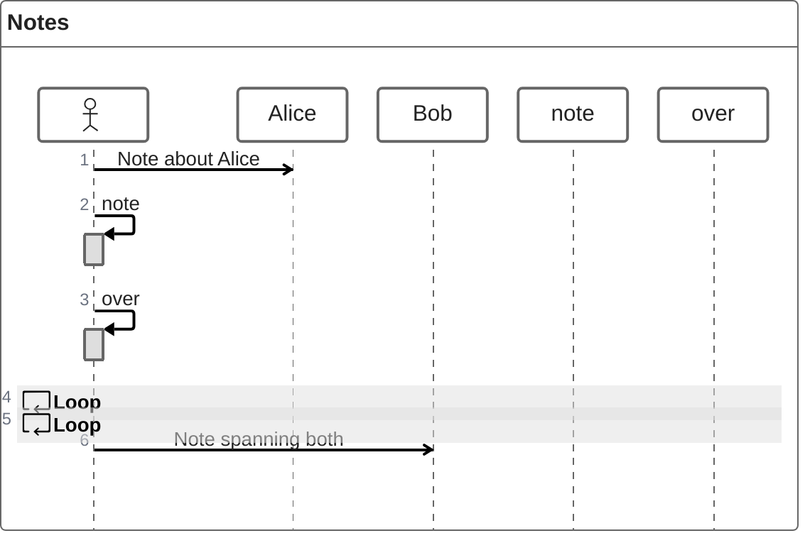
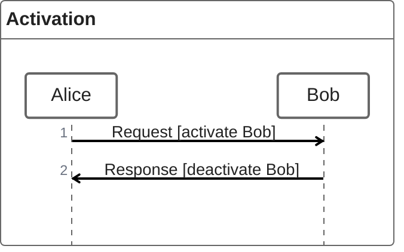
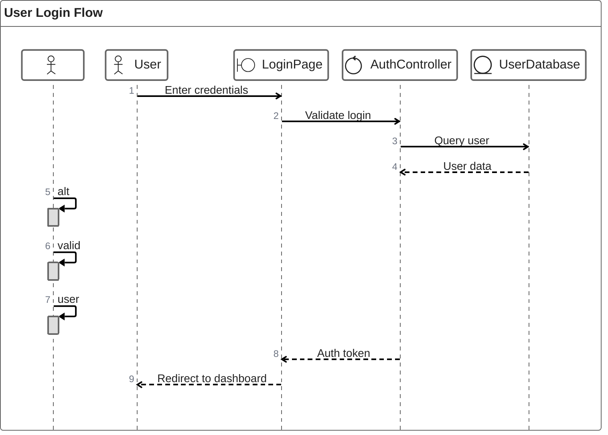
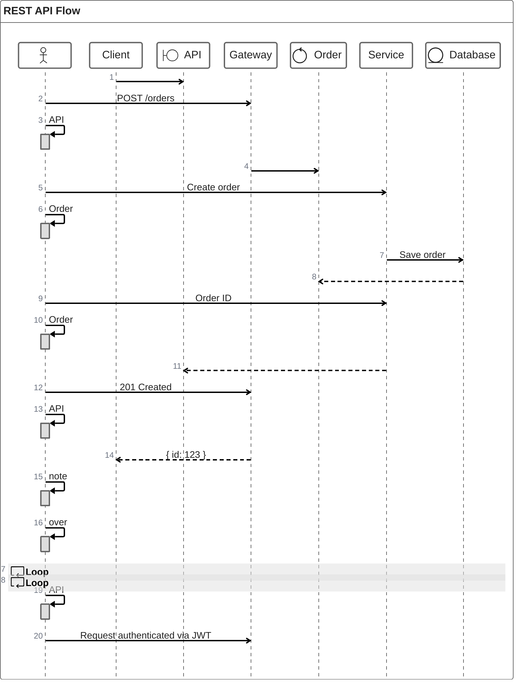
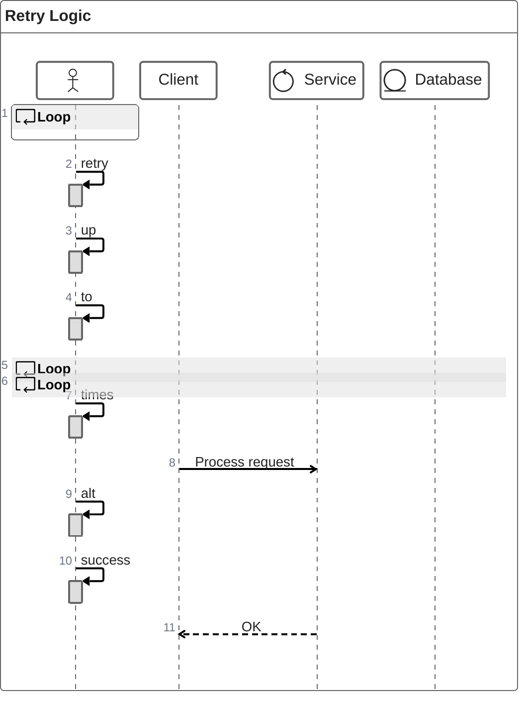

# ZenUML Reference

## Description

ZenUML is an alternative sequence diagram syntax with a cleaner, more concise notation. Supports annotators (participant symbols), groups, and activation boxes. Different from the standard `sequenceDiagram` syntax.

## Basic Syntax

## Participants

### Implicit Declaration

Participants appear on first use in messages.

### Explicit Declaration

### Annotators (Symbol Types)

| Annotator | Symbol | Description |
|-----------|--------|-------------|
| `@actor` | Stick figure | Human participant |
| `@boundary` | Screen icon | UI/boundary component |
| `@control` | Circle with arrow | Control/logic component |
| `@entity` | Cylinder | Data/entity component |

## Message Types

| Syntax | Arrow Style | Description |
|--------|-------------|-------------|
| `A->B: msg` | Solid arrow | Synchronous |
| `A-->B: msg` | Dashed arrow | Asynchronous reply |
| `A=>B: msg` | Thick arrow | |
| `A~>B: msg` | Dotted arrow | |
| `A~~>B: msg` | Dotted dashed | |

## Groups

### Supported Group Types

| Keyword | Purpose |
|---------|---------|
| `alt ... else ... end` | Conditional branches |
| `opt ... end` | Optional section |
| `loop ... end` | Repeating section |
| `par ... and ... end` | Parallel sections |
| `break ... end` | Break sequence |

## Notes

## Activation Boxes

## Examples

### Full Sequence

### API Call

### With Groups

