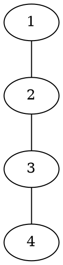

# File Formats

NetworkX supports reading and writing graphs in numerous formats, from simple edge lists to rich XML-based formats that preserve attributes.

## GraphML

Graph Markup Language (GraphML) is an XML-based format that preserves graph structure and attributes.

```python
import networkx as nx

G = nx.Graph()
G.add_node(1, label="Node 1", color="red")
G.add_edge(1, 2, weight=2.5, label="Edge 1-2")

# Write GraphML
nx.write_graphml(G, "graph.graphml")

# Read GraphML
H = nx.read_graphml("graph.graphml")

# Read as specific graph type
H = nx.read_graphml("graph.graphml", node_type=int)
DG = nx.read_graphml("graph.graphml", create_using=nx.DiGraph())

# Write with pretty printing
nx.write_graphml(G, "graph.graphml", pretty_print=True)

# GraphML versions (1.0 or 1.1)
nx.write_graphml(G, "graph.graphml", version="1.2")
```

**Features**:
- Preserves node and edge attributes
- Supports directed/undirected, multi-graphs
- Standard format for many tools (Cytoscape, yEd)

## GEXF

GEXF (Graph Exchange XML Format) is designed for Gephi but works with NetworkX.

```python
# Write GEXF
nx.write_gexf(G, "graph.gexf")

# Read GEXF
H = nx.read_gexf("graph.gexf")
DG = nx.read_gexf("graph.gexf", create_using=nx.DiGraph())

# With node type conversion
H = nx.read_gexf("graph.gexf", node_type=str)
```

**Features**:
- Rich attribute support (types, lists)
- Visual properties (node size, color, position)
- Dynamic graphs (temporal networks)
- Native format for Gephi

## GML

Graph Description Language is a human-readable format.

```python
# Write GML
nx.write_gml(G, "graph.gml")

# Read GML
H = nx.parse_gml("graph.gml")
graphs = list(nx.parse_gml("graph.gml"))  # Multiple graphs in file

# GML can contain multiple graphs
with open("multi.gml", "w") as f:
    for g in [G1, G2, G3]:
        nx.write_gml(g, f)
```

**Features**:
- Human-readable text format
- Supports attributes
- Can contain multiple graphs

## Edge Lists

Simplest format: one edge per line.

```python
# Write edge list
nx.write_edgelist(G, "graph.edgelist")

# With custom delimiter
nx.write_edgelist(G, "graph.csv", delimiter=",")

# Read edge list
H = nx.read_edgelist("graph.edgelist")

# With node type conversion
H = nx.read_edgelist("graph.edgelist", nodetype=int)

# Create directed graph from edge list
DG = nx.read_edgelist("graph.edgelist", create_using=nx.DiGraph())

# With edge attributes (requires header or explicit names)
nx.write_edgelist(G, "graph.edgelist", delimiter="\t")

# Read with attributes
H = nx.read_weighted_edgelist("graph.edgelist")  # Third column as weight
```

**File format**:
```
node1 node2
node2 node3
node3 node4
```

With weights:
```
node1 node2 2.5
node2 node3 1.0
node3 node4 3.5
```

## Adjacency Lists

```python
# Write adjacency list
nx.write_adjlist(G, "graph.adjlist")

# Read adjacency list
H = nx.read_adjlist("graph.adjlist")

# With node type
H = nx.read_adjlist("graph.adjlist", nodetype=int)

# Multiline adjacency list (for attributes)
nx.write_multiline_adjlist(G, "graph.multiline_adjlist")
H = nx.read_multiline_adjlist("graph.multiline_adjlist")
```

**File format**:
```
node1 node2 node3
node2 node1 node3 node4
node3 node1 node2 node4
node4 node2 node3
```

## JSON Formats

### Node-Link Format

Standard JSON representation of graphs.

```python
import json

# Convert to node-link data structure
data = nx.node_link_data(G)

# Write to file
with open("graph.json", "w") as f:
    json.dump(data, f, indent=2)

# Read from file
with open("graph.json", "r") as f:
    data = json.load(f)
H = nx.node_link_graph(data)

# With directed graph
DG = nx.node_link_graph(data, directed=True)

# Customize what to include
data = nx.node_link_data(
    G, 
    attributes=["weight", "label"],  # Only these edge attributes
    group="community"  # Add community grouping
)
```

**JSON structure**:
```json
{
  "directed": false,
  "multigraph": false,
  "nodes": [
    {"id": 1, "label": "Node 1", "color": "red"},
    {"id": 2, "label": "Node 2"}
  ],
  "links": [
    {"source": 1, "target": 2, "weight": 2.5}
  ]
}
```

### Tree Format (JSON)

For hierarchical data:

```python
T = nx.DiGraph()
T.add_edge("root", "child1")
T.add_edge("child1", "grandchild1")

# Convert to JSON tree
data = nx.tree_data(T, root="root")
with open("tree.json", "w") as f:
    json.dump(data, f)

# Read back
with open("tree.json", "r") as f:
    data = json.load(f)
T2 = nx.DiGraph()
nx.add_nodes_from_recursive(T2, data)
```

## Pajek Format

Format for the Pajek network analysis package.

```python
# Write Pajek format
nx.write_pajek(G, "graph.net")

# Read Pajek format
H = nx.read_pajek("graph.net")

# With weighted edges
H = nx.read_weighted_pajek("graph.net")
```

## LEDA Format

Format for the LEDA graph library.

```python
# Write LEDA format
nx.write_leda(G, "graph.g")

# Read LEDA format
H = nx.read_leda("graph.g")
```

## DOT Format

Graphviz DOT language.

```python
# Requires pygraphviz or pydot

# Using pygraphviz
try:
    import pygraphviz as pgf
    
    A = nx.nx_agraph.to_agraph(G)
    A.write("graph.dot")
    
    # Read back
    A2 = pgf.AGraph("graph.dot")
    H = nx.nx_agraph.from_agraph(A2)
    
except ImportError:
    print("pygraphviz not installed")

# Using pydot
try:
    import pydot
    
    P = nx.nx_pydot.to_pydot(G)
    P.write_dot("graph.dot")
    
    # Read back
    P2 = pydot.graph_from_dot_file("graph.dot")[0]
    H = nx.nx_pydot.from_pydot(P2)
    
except ImportError:
    print("pydot not installed")
```

**DOT format example**:


## Matrix Market Format

For adjacency matrices.

```python
# Write sparse matrix
from scipy import sparse

matrix = nx.adjacency_matrix(G)
nx.write_matrix_market(matrix, "graph.mtx")

# Read sparse matrix
matrix = nx.read_matrix_market("graph.mtx")
G = nx.from_scipy_sparse_array(matrix)

# With weights
matrix_weighted = nx.weighted_adjacency_matrix(G, weight="weight")
```

## CSV Format

Custom CSV reading/writing:

```python
import pandas as pd

# Export edges to CSV
edges = pd.DataFrame(
    [(u, v, d.get('weight', 1)) for u, v, d in G.edges(data=True)],
    columns=['source', 'target', 'weight']
)
edges.to_csv("edges.csv", index=False)

# Import edges from CSV
df = pd.read_csv("edges.csv")
G = nx.from_pandas_edgelist(
    df, 
    source='source', 
    target='target', 
    edge_attr='weight'
)

# Export nodes to CSV
nodes = pd.DataFrame(
    [(n, d) for n, d in G.nodes(data=True)],
    columns=['node', 'attributes']
)
nodes.to_csv("nodes.csv", index=False)
```

## Excel Format

```python
import pandas as pd

# Export to Excel
edges_df = pd.DataFrame(
    list(G.edges()),
    columns=['source', 'target']
)
with pd.ExcelWriter("graph.xlsx") as writer:
    edges_df.to_excel(writer, sheet_name="Edges", index=False)
    
    nodes_df = pd.DataFrame(list(G.nodes()), columns=['node'])
    nodes_df.to_excel(writer, sheet_name="Nodes", index=False)

# Import from Excel
with pd.ExcelReader("graph.xlsx") as reader:
    edges_df = pd.read_excel(reader, "Edges")
    G = nx.from_pandas_edgelist(edges_df, 'source', 'target')
```

## SQLite Database

Store graphs in a database:

```python
import sqlite3

# Store graph
def store_graph(graph, db_path="graph.db"):
    conn = sqlite3.connect(db_path)
    cursor = conn.cursor()
    
    # Create tables
    cursor.execute('DROP TABLE IF EXISTS nodes')
    cursor.execute('DROP TABLE IF EXISTS edges')
    
    cursor.execute('CREATE TABLE nodes (id TEXT PRIMARY KEY, attributes TEXT)')
    cursor.execute('CREATE TABLE edges (source TEXT, target TEXT, attributes TEXT)')
    
    # Insert data
    import json
    for node, attrs in graph.nodes(data=True):
        cursor.execute(
            'INSERT INTO nodes VALUES (?, ?)',
            (str(node), json.dumps(attrs))
        )
    
    for source, target, attrs in graph.edges(data=True):
        cursor.execute(
            'INSERT INTO edges VALUES (?, ?, ?)',
            (str(source), str(target), json.dumps(attrs))
        )
    
    conn.commit()
    conn.close()

# Load graph
def load_graph(db_path="graph.db"):
    import json
    conn = sqlite3.connect(db_path)
    cursor = conn.cursor()
    
    G = nx.Graph()
    
    cursor.execute('SELECT id, attributes FROM nodes')
    for row in cursor.fetchall():
        G.add_node(row[0], **json.loads(row[1]))
    
    cursor.execute('SELECT source, target, attributes FROM edges')
    for row in cursor.fetchall():
        G.add_edge(row[0], row[1], **json.loads(row[2]))
    
    conn.close()
    return G
```

## Format Selection Guide

| Use Case | Recommended Format |
|----------|-------------------|
| General purpose with attributes | GraphML |
| Gephi integration | GEXF |
| Simple networks, no attributes | Edge list |
| Human-readable | GML or DOT |
| Web applications | JSON (node-link) |
| Scientific computing | Matrix Market |
| Large-scale data | CSV + pandas |
| Persistent storage | SQLite |

## Reading Multiple Formats

```python
# Auto-detect format from file extension
def read_graph(filename):
    if filename.endswith('.graphml'):
        return nx.read_graphml(filename)
    elif filename.endswith('.gexf'):
        return nx.read_gexf(filename)
    elif filename.endswith('.gml'):
        return list(nx.parse_gml(filename))[0]
    elif filename.endswith('.edgelist') or filename.endswith('.txt'):
        return nx.read_edgelist(filename)
    elif filename.endswith('.json'):
        with open(filename) as f:
            return nx.node_link_graph(json.load(f))
    elif filename.endswith('.dot'):
        try:
            A = pgf.AGraph(filename)
            return nx.nx_agraph.from_agraph(A)
        except:
            raise ValueError("DOT requires pygraphviz")
    else:
        raise ValueError(f"Unknown format: {filename}")
```

## Writing to Multiple Formats

```python
def save_graph(graph, filename):
    if filename.endswith('.graphml'):
        nx.write_graphml(graph, filename)
    elif filename.endswith('.gexf'):
        nx.write_gexf(graph, filename)
    elif filename.endswith('.gml'):
        nx.write_gml(graph, filename)
    elif filename.endswith('.edgelist'):
        nx.write_edgelist(graph, filename)
    elif filename.endswith('.json'):
        with open(filename, 'w') as f:
            json.dump(nx.node_link_data(graph), f, indent=2)
    else:
        raise ValueError(f"Unknown format: {filename}")
```
