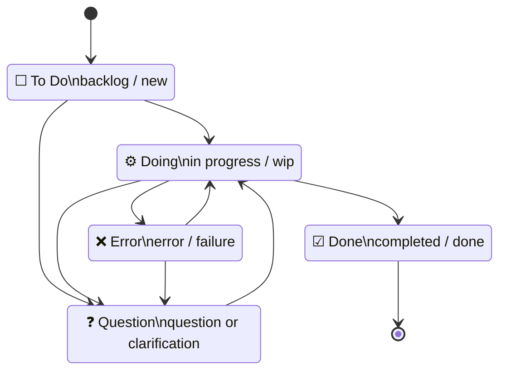

```mermaid
stateDiagram-v2
    direction TB

    [*] --> todo

    state "☐ To Do\nbacklog / new" as todo
    state "❓ Question\nquestion or clarification" as question
    state "⚙️ Doing\nin progress / wip" as doing
    state "❌ Error\nerror / failure" as error
    state "☑ Done\ncompleted / done" as done

    todo --> doing
    todo --> question
    doing --> question
    doing --> error
    doing --> done
    question --> doing
    error --> doing
    error --> question

    done --> [*]
```
