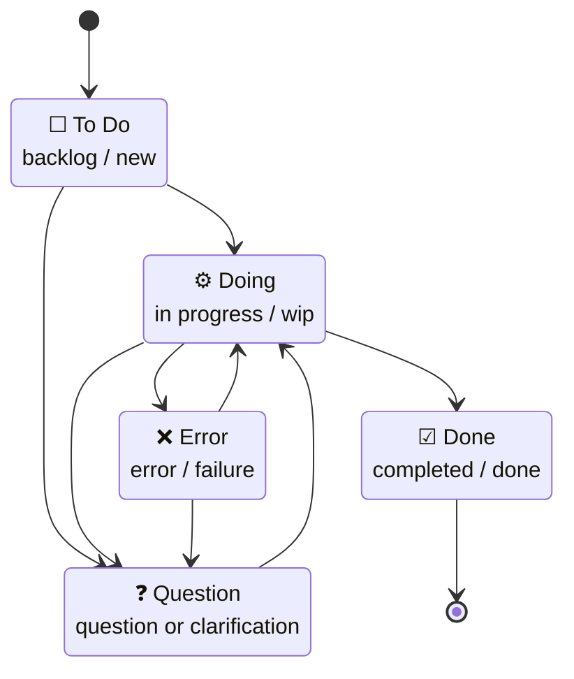

```mermaid
stateDiagram-v2
    direction TB

    [*] --> todo

    state "☐ To Do<br>backlog / new" as todo
    state "❓ Question<br>question or clarification" as question
    state "⚙️ Doing<br>in progress / wip" as doing
    state "❌ Error<br>error / failure" as error
    state "☑ Done<br>completed / done" as done

    todo --> doing
    todo --> question
    doing --> question
    doing --> error
    doing --> done
    question --> doing
    error --> doing
    error --> question

    done --> [*]
```
