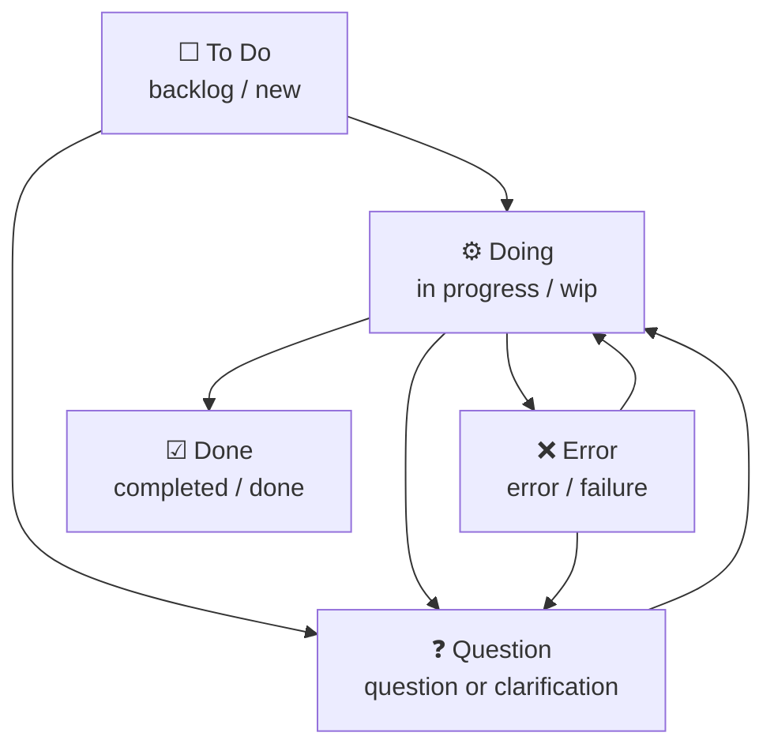

```mermaid
flowchart TD
    todo["☐ To Do<br>backlog / new"]
    question["❓ Question<br>question or clarification"]
    doing["⚙️ Doing<br>in progress / wip"]
    error["❌ Error<br>error / failure"]
    done["☑ Done<br>completed / done"]

    todo --> doing
    todo --> question
    doing --> question
    doing --> error
    doing --> done
    question --> doing
    error --> doing
    error --> question
```
